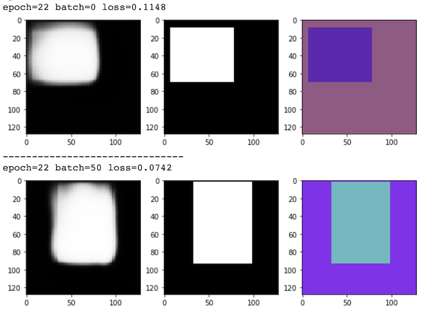
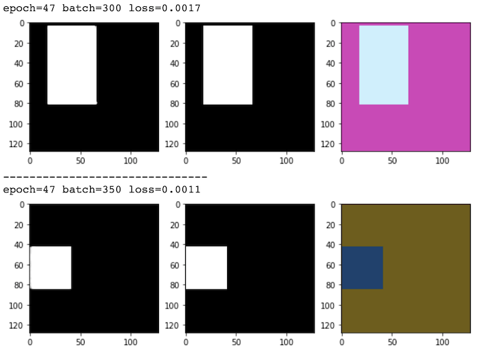

### Neural-network-based predictor for area of a rectangle

#### Task
The task is to determine a pixel area of one rectangle on an image.

The size of provided dataset is obviously very small for training any deep learning model. Consequently I've decided to go with a synthetic dataset for training. As for the model, I've experimented with a couple of unconventional light models, which did not result in a success presumably due to the small size of the dataset and a very weak target (just 2 scalars for an image). Thus I've stopped on a classical semantic segmentation proxy task. In this case interior of a rectangle is annotated as foreground class (1 or white), exterior - as background class (0 or black). As a feature extractor I've chosen a standard solution: UNet. Channel number of the used model is significantly lower that of the original UNet since the task is relatively simple.

The model turns out to be a bit too beefy - 30 MB. The footprint can be shrinked by reducing channels in the bottleneck of Unet hourglass. A trained model is included into this deliverable.

The work resolution is chosen to be 128x128 to speedup training. Training took about 45 minutes on T4 in Google Colab.

Accuracy of prediction I am estimating as a difference in predicted and ground truth areas divided by ground truth area. This metric (averaged over 69 annotated images) in the provided dataset is approximately 1.1%. It can be reduced to almost zero by increasing the resolution of the network to native 256x256 and extra shaping of channels in encoder and decoder of UNet.

With regards to the provided dataset, one can notice that all the noise in the images comes to alpha channel. Thus I've decided to throw away alpha channel, and the network is trained on RGB channels. This also simplifies synthetic image generator.

Intermediate results of training (from left to right: prediction map, ground truth segmentation, input image):



Fully trained model's predictions:




#### Code

I am using PyTorch as a DL framework. The main code and entry point are located in trainer.py.

To install requirements:
```
pip install -r requirements.txt
```

Custom dataset is assumed to be located at `"data/"` folder next to the script.

The default mode of the script is to launch training:
```
python trainer.py
```
After finishing the script will produce a PyTorch model - snapshot.pth.

For evaluation, given a snapshot.pth, one can run
```
python trainer --evaluate
```
to get results of accuracy evaluation.

I am also asked to provide a function to preform inference. It is implemented as a function class Predictor. It assumes snapshot.pth file present in the directory. How to use Predictor:
```
predictor = Predictor()
area = predictor(image_np_hwc)
area = predictor(image_np_hwc)
```

Predictor is tested with a unit test in unit_tests.py.
```
python unit_tests.py
```
